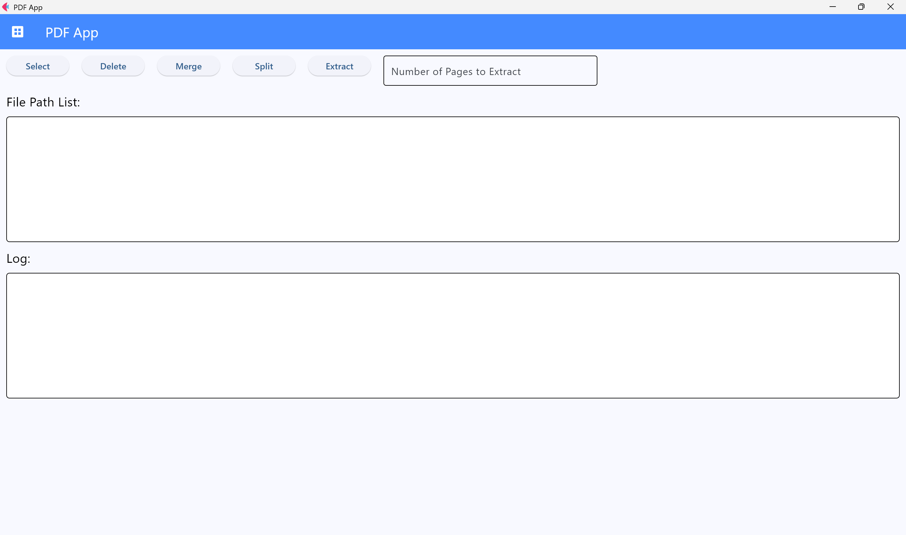

<!--
    README
 -->

# Flet PDF App

<!-- [](./README.md) -->
<!-- [](./README_JA.md) -->
[](./README.md)
[](./LICENSE)
[](https://mypy-lang.org/)
[](https://github.com/astral-sh/ruff)
[](https://github.com/astral-sh/uv)

[](https://github.com/python)
[](https://github.com/sphinx-doc/sphinx)
[](https://github.com/pytest-dev/pytest)
[](https://github.com/pydantic/pydantic)

This repository is an app using [Flet][flet] to merge, split and extract pages from pdf files.

[flet]: https://flet.dev/

## How to use

This section describes how to use this app.

This assumes that you have flet installed.

* Launch the app.

  In Desktop mode:

  ``` bash
  flet run app.py
  ```

  In Web mode:

  ``` bash
  flet run --web app.py
  ```

* Press the `Select` button and select files.

  When a file is selected, the `File Path List` displays the selected file and a corresponding `Delete` button.

  Files displayed in the `File Path List` can be reordered by drag and drop.

  Pressing the `Delete` button will delete the corresponding file.

* Press the `Merge` button and all files will be merged.

* Pressing the `Split` button will split all pages from the file.

* Pressing the `Extract` button will extract pages from the file.

  Enter the form (`Number of pages to Extract`) to select the pages you want to extract.

* Pressing the `Delete` button at the top of the screen will delete all files displayed in the `File Path List` (, not directory).

### Attention

In Web mode:

* When selecting a file, the file path cannot be obtained, so the selected file must be in the same directory as `app.py`.

In Desktop mode:

* When selecting a file, you can get the file path, so it doesn't matter where the file is located.

  However, this doesn't work well when launching the app in a virtual environment like WSL.

## About the app screen



1. Button (`Select`, `Delete`, `Merge`, `Split`, `Extract`)

    |Name   |Description                 |
    | ---   | ---                        |
    |Select |Select files.               |
    |Delete |Delete all files.           |
    |Merge  |Merge files.                |
    |Split  |Split all pages of the file.|
    |Extract|Extract pages from the file.|

1. Enter form (`Number of pages to Extract`)

   You can enter numbers separated by commas.

   You can also use hyphens to connect consecutive numbers.

   You can enter numbers connected with multiple hyphens, such as `10-5-15`, which is the same as `5-15`.

    Correct Example:

   ``` None
   1,5,10-15,20,40-35,50-55-45
   ```

   Incorrect Example:

   ``` None
   1,
   ```

   ``` None
   ,1
   ```

   ``` None
   10-
   ```

   ``` None
   -10
   ```

1. `File Path List`

    The selected file and a corresponding `Delete` button are displayed.

    The displayed files can be reordered by drag and drop.

    Pressing the `Delete` button will delete the corresponding file.

1. `Log`

    The processing log will be displayed.

## Building a development environment

If you do not yet have a Python development environment, please see below.

* [How to build development environment.](https://github.com/r-dev95/env-python) (Japanese only)

## License

This repository is licensed under the [BSD 3-Clause](LICENSE).
